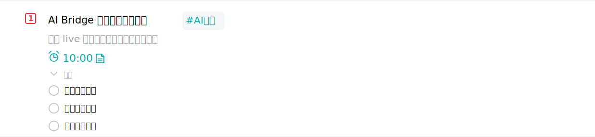

# Todo List Planner Skill

[中文](README.md) | English

`Todo List Planner` is a local Codex Skill that turns incoming messages, notes, screenshot descriptions, and daily information into actionable tasks in the Windows app [Todo清单](https://todo.evestudio.cn/).

The project package name remains `todo-list-planner`. The repository folder may use a broader project name such as `Hack3rX_2026_008_AiSkills_todo-list-planner`.

## Repository Layout

```text
.
├── .git/
├── .gitignore
├── docs/
│   └── images/
│       └── todo-live-example.svg
├── README.md
├── README_EN.md
└── todo-list-planner/
    ├── SKILL.md
    ├── agents/
    │   └── openai.yaml
    ├── package.json
    ├── todo.ps1
    ├── Start-TodoDebug.ps1
    ├── mcp.example.json
    └── src/
```

`todo-list-planner/` is the distributable Skill body. Users only need this directory when installing the Skill.

## Features

- Plan tasks from natural-language input.
- Write tasks through Todo清单's live renderer runtime, avoiding direct database edits and app restarts.
- Support title, description, date, reminder, difficulty, category, subtasks, repeat rules, image attachments, and `#` tags.
- Record every AI-created task so incorrect tasks can be deleted later.
- Provide both CLI and MCP interfaces.

## Requirements

- Windows
- Node.js 20+
- PowerShell
- Installed [Todo清单](https://todo.evestudio.cn/)
- A working local Todo清单 app session

## Install As A Skill

Copy `todo-list-planner/` into your Codex Skills directory:

```powershell
Copy-Item -Recurse .\todo-list-planner "$env:USERPROFILE\.codex\skills\todo-list-planner"
```

If your Skills directory is different, keep the installed folder name as `todo-list-planner`.

## Quick Start

Enter the Skill directory:

```powershell
cd .\todo-list-planner
```

Start the live bridge:

```powershell
.\Start-TodoDebug.ps1 -Restart
```

Check status:

```powershell
.\todo.ps1 doctor --port 9222
```

Add a task:

```powershell
.\todo.ps1 add --mode live --title "Test task" --desc "Created by Todo List Planner" --date today --remind 10:00 --difficulty medium --category "Work" --tags "AI" --subtasks "Step 1,Step 2"
```

## Usage Example

The following example shows a task created by this Skill in Todo清单:



The example includes a title, description, 10:00 reminder, image attachment, `#AI测试` tag, and three subtasks.

## Common Commands

```powershell
.\todo.ps1 categories --json
.\todo.ps1 tags --json
.\todo.ps1 features
.\todo.ps1 records --json
.\todo.ps1 delete --record-id rec_...
```

Command notes:

- `categories` reads user categories from Todo清单.
- `tags` reads existing `#` tags from Todo清单.
- `features` prints the task fields currently supported by the bridge.
- `records` lists tasks created by AI.
- `delete` removes AI-created tasks by `recordId`, `operationId`, `taskId`, or `--last 1`.

## MCP Configuration

The Skill includes `mcp.example.json`. Replace `<absolute-path-to-this-skill>` with the absolute path to your local `todo-list-planner` folder:

```json
{
  "mcpServers": {
    "todo-list-planner": {
      "command": "node",
      "args": [
        "<absolute-path-to-this-skill>\\src\\mcp-server.js"
      ]
    }
  }
}
```

Available MCP tools:

- `add_todo`
- `list_ai_records`
- `delete_ai_added`
- `list_categories`
- `list_tags`
- `features`
- `doctor`

## Data And Privacy

This repository should not include user Todo data or runtime audit logs. Runtime logs are written by default to:

```text
%APPDATA%\todo-list-planner\ai-added-tasks.jsonl
```

Set `TODO_LOG_PATH` to override the log path.

Notes:

- Live mode reads local Todo清单 runtime state for categories, tags, task creation, and deletion.
- DB mode is only a fallback and requires explicit `TODO_EXE` and `DB_ENCRYPTION_KEY`.
- Image uploads rely on the Todo清单 app's own login state and upload flow.
- Image attachments are not combined with repeated tasks.

## Community

Welcome to join the community and learning channels. More content will be updated later:

<p align="center">
  
  
</p>

The community text and images above are from [Blue-Seventeen/MarkTrans](https://github.com/Blue-Seventeen/MarkTrans).
